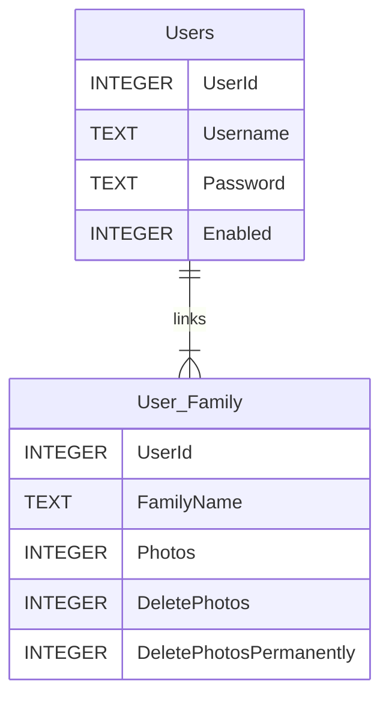
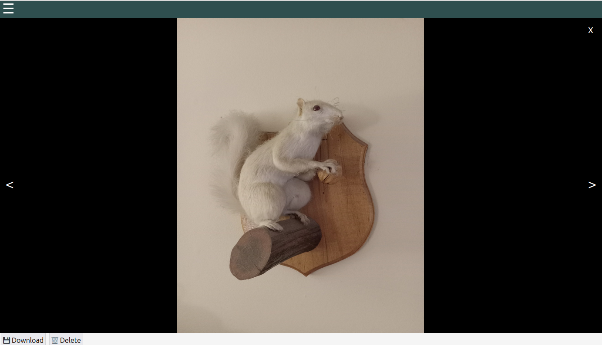

# Introduction
This project is the logical conclusion of the [PhotoImporter](https://github.com/jacobrobertjohnson/PhotoImporter) application. Once **PhotoImporter** sorts images and catalogs them in a [SQLite](https://www.sqlite.org/index.html) database, **PhotoSite** exposes them for viewing in a web browser.

Similarly to the **PhotoImporter** goals, **PhotoSite** aims to:

- Allow photos to be accessed anywhere
- Separate data by family unit, while maintaining a single login per user
- Provide some basic CRUD functionality, including:
    - Deletion (single or bulk)
    - Moving between families
    - Original-size image downloads
- Manage all of the above via permissions stored in a SQLite database file

|:warning: Note|
|:--|
|This is a very early prototype of the project. Code quality and styling are very rough, and will improve over time.|

# Setup
## Requirements
- .NET 6 & ASP.NET 6 SDK & Runtime
- The SQLite database & image files from an existing **PhotoSite** import

|:warning: Note|
|:--|
|This site has only been tested on Ubuntu Server 22.0.4.2 LTS, using the Kestrel server built into ASP.NET. Exposure to the Internet is via [Cloudflare Tunnels](https://www.cloudflare.com/products/tunnel/).|

## Sample appsettings.json file
As a .NET 6 application, **PhotoSite** stores its configuration in the `appsettings.json` file. The following format is expected:

```JSON
{
    "AppSettings": {
        "UserDbPath": "/ContentLibrary/Libraries/Users.db",
        "MachineKey": "6fd410b8-1e26-4434-8f5a-7f33d6b4baa9",
        "Families": [
            {
                "Id": "MeanMrMustard",
                "Name": "Mean Mr. Mustard",
                "PhotoDbPath": "/ContentLibrary/Libraries/MeanMrMustard/Photos.db",
                "PhotoFilePath": "/ContentLibrary/Libraries/MeanMrMustard/Photos/",
                "PhotoThumbnailPath": "/ContentLibrary/Libraries/MeanMrMustard/Thumbnails/"
            }, {
                "Id": "Edison",
                "Name": "Maxwell Edison",
                "PhotoDbPath": "/ContentLibrary/Libraries/Edison/Photos.db",
                "PhotoFilePath": "/ContentLibrary/Libraries/Edison/Photos/",
                "PhotoThumbnailPath": "/ContentLibrary/Libraries/Edison/Thumbnails/"
            }
        ]
    }
}
```

|Property|Description|Created Automatically?|
|---|---|---|
|`AppSettings.UserDbPath`|Path to a SQLite file containing Users and their Family permissions|Yes|
|`AppSettings.MachineKey`|String value used for hashing User passwords. **Keep this private!!!**||
|`AppSettings.Families`|Array of Families whose photos can be accessed via the website.||
|`AppSettings.Families[].Id`|Unique string identifier for this Family. Used in URLs and the User link table in the SQLite file at `AppSettings.UserDbPath`.||
|`AppSettings.Families[].Name`|Display name for this Family. Used in the Family Selection screen and in the header of the Photo Grid.||
|`AppSettings.Families[].PhotoDbPath`|Path to the SQLite file that was populated by **PhotoImporter***.|No|
|`AppSettings.Families[].PhotoFilePath`|Path to the sorted photo folder that was populated by **PhotoImporter***.|No|
|`AppSettings.Families[].PhotoThumbnailPath`|Path to the cached thumbnails folder that was populated by **PhotoImporter***.|No|

*More information on recommended filesystem structures can be found in the [PhotoImporter README](https://github.com/jacobrobertjohnson/PhotoImporter#sample-setup-scenario).

## User DB Structure
### Diagram


### Table Descriptions

|:warning: Note|
|:--|
|Since SQLite does not support a `BIT` or similar boolean datatype, `INTEGER` columns containing `1` or `0` are used instead.|

#### Users
Contains basic login information for each User that is permitted to access the site.

|Column Name|Datatype|Description|
|---|---|---|
|`UserId`|`INTEGER PRIMARY KEY`|Primary key identifying the user.|
|`Username`|`TEXT`|Plaintext username used for logging in.|
|`Password`|`TEXT`|Salted & hashed password used for logging in.|
|`Enabled`|`INTEGER`|Whether the user is allowed to log in. Used for temporarily preventing access without entirely removing the user.|

#### User_Family
Links a User to one or more Families. Sets various per-Family permissions for the User.

|Column Name|Datatype|Description|
|---|---|---|
|`UserId`|`INTEGER FOREIGN KEY REFERENCES User(UserId)`|Primary key identifying the user.|
|`FamilyName`|`TEXT`|Unique string identifier for the linked Family. Must match the value in `AppSettings.Families[].Id`|
|`Photos`|`INTEGER`|Indicates whether the user is permitted to see Photos for this Family.|
|`DeletePhotos`|`INTEGER`|Indicates whether the user is permitted to send Photos to the **Delete Items** section in this Family.|
|`DeletePhotosPermanently`|`INTEGER`|Indicates whether the user is permitted to access the **Delete Items** section in this Family, and permanently delete photos from it.|

## User Creation Process
As stated above, this is an early version of the codebase. Eventually, I will get around to creating an initial setup script and a basic User management application. Until then, I have been using the following workaround to create users:

1. Set up the site on a local development machine, ensuring that the desired `AppSettings.MachineKey` value is in place.
1. Attempt to log in. This will automatically create the SQLite database at `AppSettings.UserDbPath` with the expected table structure.
1. In the User database,`INSERT` a record with the desired username into `Users`:
    ```SQL
    INSERT INTO Users (
        Username,
        Password,
        Enabled
    ) VALUES (
        `MaxEdison`,
        NULL,
        1
    )
    ```
1. Attach a debugger to the website.
1. Set a breakpoint on this line at the beginning of the `Authenticate()` method in `src/Users/SqliteUserProvider.cs`:
    ```C#
    string hashedPassword =  _cryptoProvider.HashValue(plainPassword, username, _machineKey);
    ```
1. Log into the site with the desired username and password.
1. Hover over the result of `hashedPassword`, and copy its value.
1. In the User database, `UPDATE` the relevant `Users` record with the copied hashed password:
    ```SQL
    UPDATE  Users
        SET Password = 'value-you-just-copied'
    WHERE   Username = 'MaxEdison'
    ```

|:warning: Note|
|:--|
|I am looking forward to the day when I can delete the above instructions.|

# Screenshots
## Login Screen


## Family Selection


## "Change Password" Screen


## Photo Grid
### Sidebar Collapsed


### Sidebar - Date Taken Filter


### Sidebar - Camera Model Filter


### Zoomed out


### Zoomed In


## Photo Viewer

