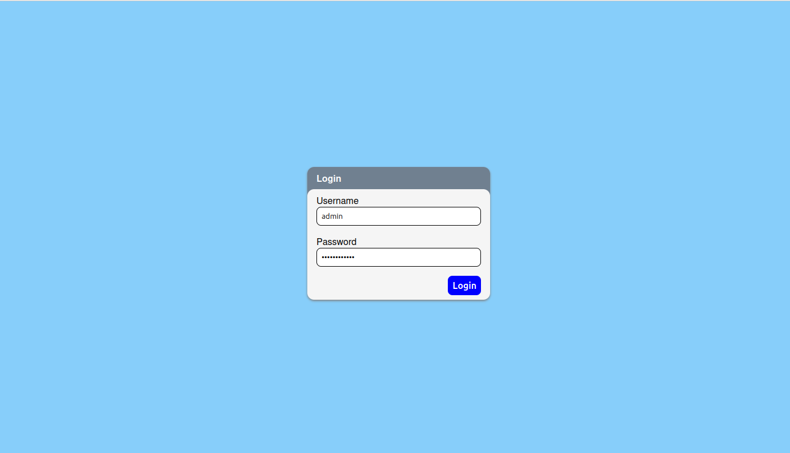
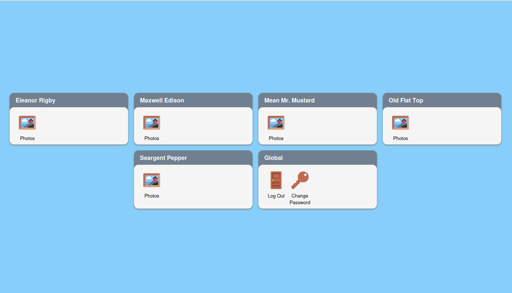
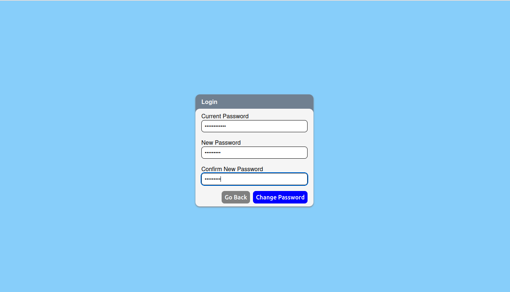
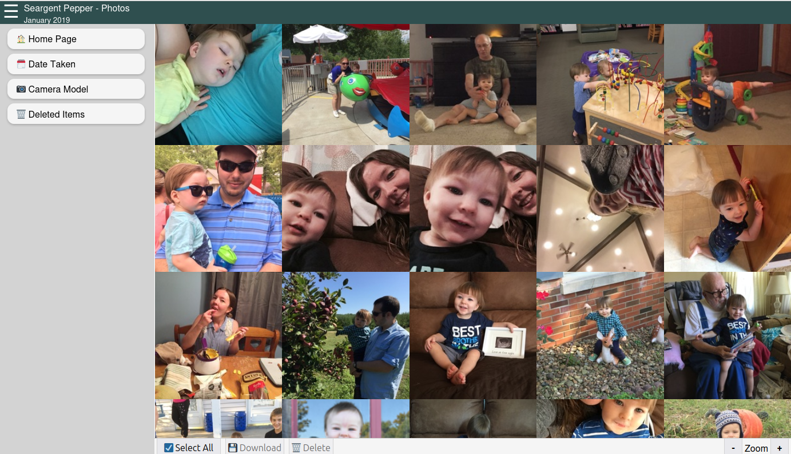
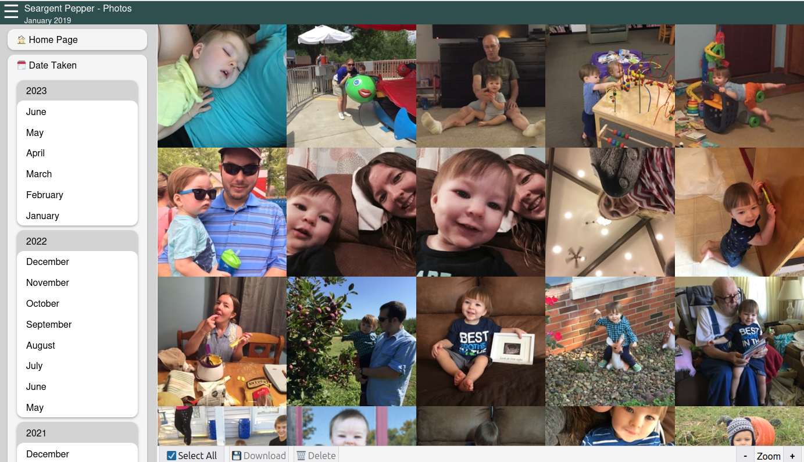
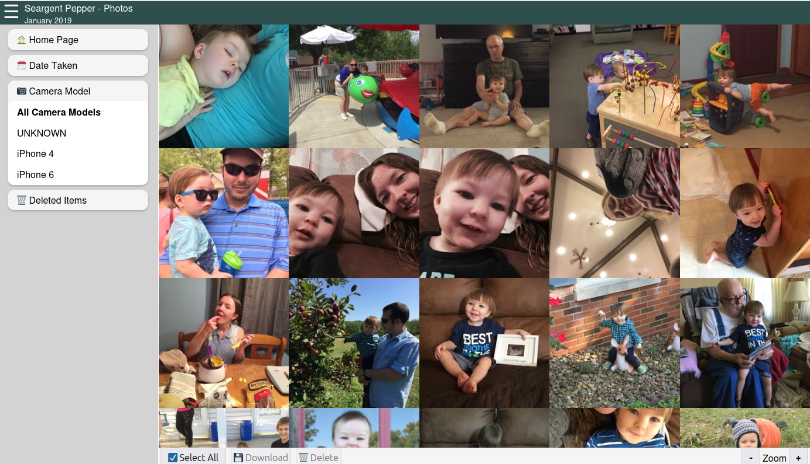
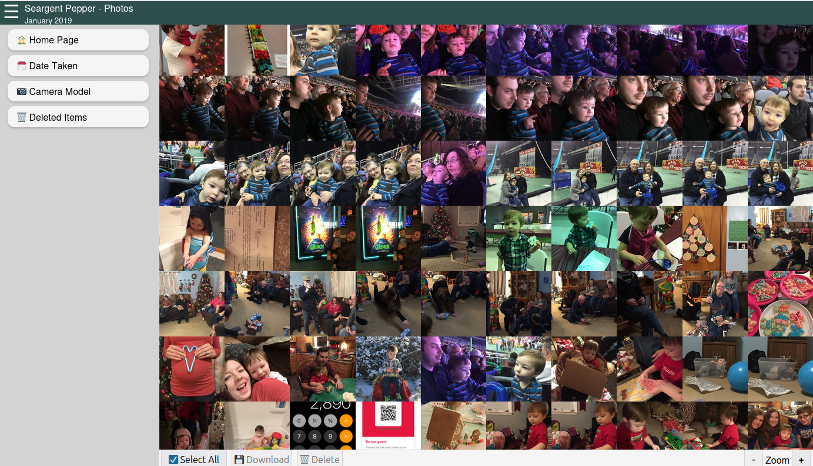
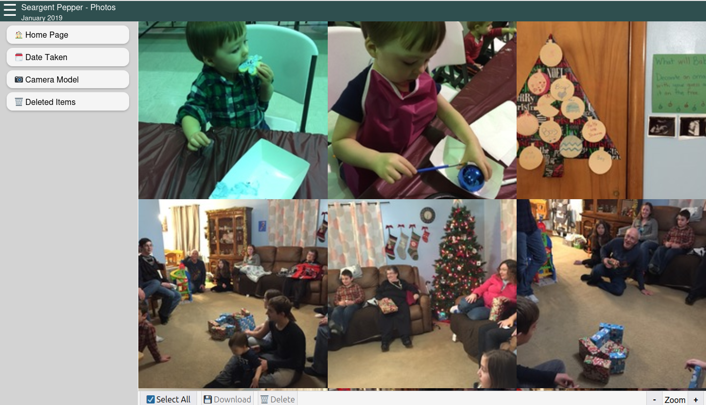

# Introduction
This project is the logical conclusion of the [PhotoImporter](https://github.com/jacobrobertjohnson/PhotoImporter) application. Once **PhotoImporter** sorts images and catalogs them in a [SQLite](https://www.sqlite.org/index.html) database, **PhotoSite** exposes them for viewing in a web browser.

Similarly to the **PhotoImporter** goals, **PhotoSite** aims to:

- Allow photos to be accessed anywhere
- Separate data by family unit, while maintaining a single login per user
- Provide some basic CRUD functionality, including:
    - Deletion (single or bulk)
    - Moving between families
    - Original-size image downloads
- Manage all of the above via permissions stored in a SQLite database file

> **Note**
> 
> This is a very early prototype of the project. Code quality and styling are very rough, and will improve over time.

# Setup
## Requirements
- .NET 6 & ASP.NET 6 SDK & Runtime
- The SQLite database & image files from an existing **PhotoSite** import

> **Note**
> This site has only been tested on Ubuntu Server 22.0.4.2 LTS, using the Kestrel server built into ASP.NET. Exposure to the Internet is via [Cloudflare Tunnels](https://www.cloudflare.com/products/tunnel/).

# Screenshots
## Login Screen

## Family Selection

## "Change Password" Screen

## Photo Grid
### Sidebar Collapsed

### Sidebar - Date Taken Filter

### Sidebar - Camera Model Filter

### Zoomed out

### Zoomed In

